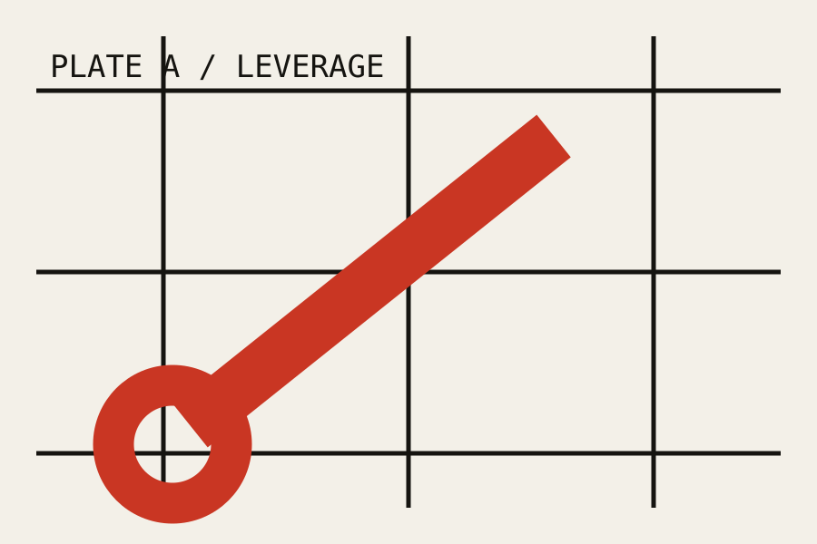

Every cupboard needs a drawer that sticks. This one contains a
[maintenance essay](/essays/maintenance-is-a-design-material/), an
[outside source](https://example.invalid/source), and several mechanisms of
uncertain provenance.

## A heading with a handle

> A record becomes useful when its assumptions remain visible.
{caption="Memo found under the kettle"}

| Mechanism | Job | Condition |
| --- | --- | --- |
| Heading | Give the page somewhere to go | Bolted on |
| Table | Keep incompatible things nearby | Holding |
| Link | Open a door in the wall | Suspicious |
{sortable=true}

```toml
[params.noFate]
defaultMode = "editorial"
```


Smooth systems hide their seams. Useful systems leave enough room for a
screwdriver.





The third lever is ceremonial. Pull it only when somebody important is watching.



If nobody can repair it, it is only borrowing your time.







A specification for people who would rather show their workings.



1. A question is recorded.
2. Its assumptions are reviewed.
3. Somebody brings biscuits.
4. The record is revised.



{.wide .technical credit="Night shift" source="Drawer 3" figure="10" dark-src="plates/plate-b.png"}


